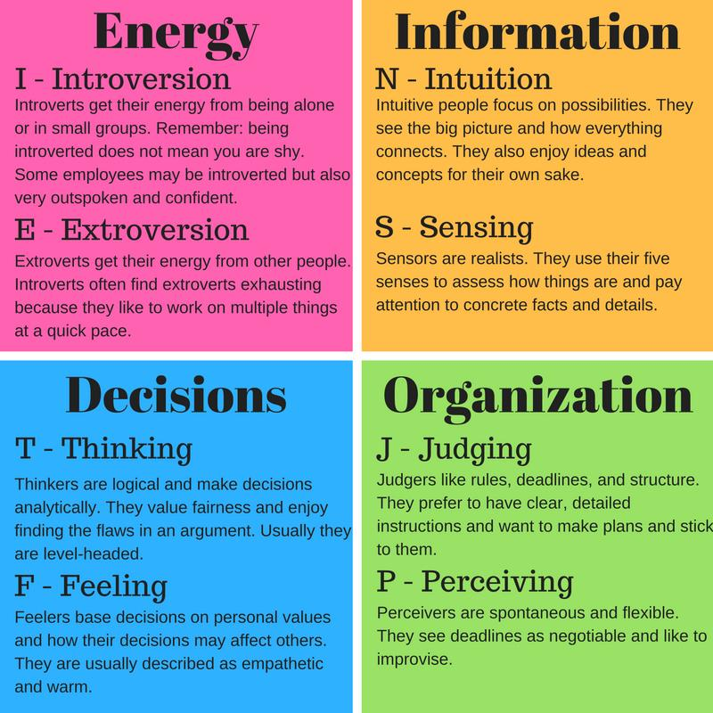

# DSI - 16 Capstone Project -  Personality Prediction 

Rachel Lim

# Readme

<h1>Table of Contents<span class="tocSkip"></span></h1>
<div class="toc"><ul class="toc-item"><li><span><a href="#Introduction" data-toc-modified-id="Introduction-1">Introduction</a></span></li><li><span><a href="#Problem-Statement" data-toc-modified-id="Problem-Statement-2">Problem Statement</a></span></li><li><span><a href="#Methodology" data-toc-modified-id="Methodology-3">Methodology</a></span></li><li><span><a href="#Findings-and-Conclusion" data-toc-modified-id="Findings-and-Conclusion-4">Findings and Conclusion</a></span></li><li><span><a href="#References" data-toc-modified-id="References-5">References</a></span></li><li><span><a href="#Notebook-Organization" data-toc-modified-id="Notebook-Organization-6">Notebook Organization</a></span></li></ul></div>

## Introduction

When hiring today, employers take great care to make sure they find the right person for their open role. They review endless resumes, conduct phone screens and interviews, and may even have candidates take skills assessments. 

One of the most important things to evaluate in a new hire is their personality fit both with the team and with the role for which they are interviewing. The hiring manager can use these to understand how extroverted or introverted a candidate is, how they communicate, what motivates them, or even how resilient they are in the face of challenges – all key aspects of a particular le e.g. sales

In roles such as these that have a high degree of human interaction, it can be beneficial to understand how the candidate communicates, how they interact with others, or whether they focus on details or see the big picture.

The Myers-Briggs Type Indicator (MBTI) test is arguably one of the most well-known and common personality assessments used today. 89% of Fortune 100 companies use the Myers-Briggs assessment in their hiring process or in a professional development capacity.

**ABOUT MBTI:** 

*The Myers-Brigg typology is based on Jung’s theory of psychological types. It was constructed by the mother and daughter team of Katherine Cook Briggs and Isabel Briggs Myers. Katherine Briggs had used Jungian notions of personality to analyze characters in literature.*

*The essence of the theory is that much seemingly random variation in the behavior is actually quite orderly and consistent, being due to basic differences in the ways individuals **prefer** to use their perception and judgment.* [[1]](https://www.myersbriggs.org/my-mbti-personality-type/mbti-basics/)

MBTI evaluates the personality along 4 different traits, representing the way one processes the surrounding information based on their **preferences** (not ability) and natural tendencies. The four traits are:


# 

## Problem Statement

A psychological tool or personlity assessment is often used to help people in numerous organisations and institutions with leadership, influencing, change, career development, team-work, conflict, managing others, developing relationships and more besides. 

However, administering a full assessment can be 
- Tedious and time-consuming, sometimes invasive (for someone being assessed) -> Long Questionnaire
- Bias - Applicants may answer the assessment questions with what they think the manager wants to hear instead of their true feelings or tendencies, leading to biased results.
- Assessment questions may reflect more of a snapshot of the candidate at that moment in time, rather than how they think and act long term across multiple situations.

By developing a model that can predict the personality type through a someone's short text  messages on social media posts,  career advisers, recruiters and hiring managers can quickly assess candidates on how comfortable or adaptable will the candidate be in a certain role; They can also have better engagement with the candidates through their preferred way of thinking and behaving (e.g. Intuition Types prefer creative, big picture, long term development in career while Sensing Types would better relate with actual facts and scope of the any given role)

## Methodology

**Dataset**

To build a model for prediction, we make use of this [dataset from Kaggle](https://www.kaggle.com/datasnaek/mbti-type):
which was collected through the [PersonalityCafe](http://personalitycafe.com/forum/) forum, as it provides a large selection of people and their MBTI personality type, as well as what they have written.

This dataset contains over 8600 rows of data, on each row is a person’s:

- Type (This persons 4 letter MBTI code/type)
- A section of each of the last 50 things they have posted (Each entry separated by "|||" (3 pipe characters))

I did some cleaning of the data and EDA, after which using ``Term Frequency-Inverse Document Frequency (TF-IDF) Vectorizer`` to create the word vectors of about 70k+ features . 

2 approaches was taken to do the classifying:

**Approach 1:**
- Multiclass Classifier (across all 16 types)
- 5 folds cross validation using GridSearch
- Models: Logistic Regression, Naive Bayes, Random Forest, XGBoost
- Metrics: F1-Score, Matthews Correlation Coefficient (MCC) Score

**Approach 2:**
- Binary Classifiers for each MBTI traits (I vs E, N vs S, F vs T, J vs P)
- 5 folds cross validation using GridSearch
- Models: Logistic Regression, XGBoost
- Metrics: AUC ROC score

## Findings and Conclusion

**Data**

The data was highly imbalanced in the classes, with type **INFP** being the majority class. From the WordCloud, it also shows that the words used among the classes are very similar. Initital thought is that the multi-class classifier may not perform well. 


**Modelling**

Truth enough, **Approach 1 with multiclassifer** only achieved best result of **35%** accuracy with F1-score of **0.36** using **Logistic Regression**. Even after applying SMOTETomek to combine over and undersampling to balance out the data, as well as using several vectors (n-gram, Doc2Vec) techniques but none of those improved the results. 

Next, **Approach 2 of 4 x binary classifer** also did not provide satisfactory results. All binary classifiers have borderline AUC ROC score of **0.5**, which means they are not capable to classify the classes well. They can perform well on majority classes but will not do well in the minority classes.

The prediction using 2 famous person's quotes extracted from the internet also proved that the accuracy was not great. One predicted only 50& right (2 of the axes) and the other one had 3 correct predictions but from the majority class (I, N, J)


**Conclusion**

Based on the findings, the conclusion(s) I draw is that:

- The dataset available is not comprehensive enough to determine the various types
- Certain personality traits may not be defined well in words or language. e.g. Introversion and Extroversion may not be distingusiable using language, but then again, the data we have for E types are much lesser than I types
- Personality Trait is a far more complex area and more than just words, and language expression.  Even with the most in-depth assessment, it can be difficult to truly measure the nuances of human behavior and distil it into a certain category or type. 
- More research needs to be done to determine if in future we are able to predict the personality just by text alone.

## References

[1] https://www.myersbriggs.org/my-mbti-personality-type/mbti-basics/

[2] https://www.16personalities.com/personality-types

[3] https://www.psychologyjunkie.com/2018/06/19/how-to-spot-each-myers-briggs-personality-type-in-conversation/

[4] https://medium.com/@makingbusinessmatter/the-ultimate-guide-to-myers-briggs-29253737a966

[5] https://www.greeneresources.com/blog/culture/personality-tests-in-hiring/

## Notebook Organization

This project is organized into 3 different notebooks with the following parts 

- **Part 1: Business Problem, Loading in the dataset, EDA and data-preprocessing**
  - Identification of the business problem
  - The Approach to solve the problem
  - Load raw data 
  - EDA (data distribution, Number of subposts, number of links, number of words/POS, word cloud)
  - Cleaning of strings (removal of URL, remove NLTK stop words, remove target related words)
  - Word cloud and common words for each type
  - Mapping the data based on type traits
  - Saving file for Modelling use
 
 
- **Part 2: Multi Class Modelling (16 Classes for the personality type)**
  - Multiclass Modelling with Hyperparameter tuning and Vectorizers
  - Resampling with SMOTE and SMOTETomek to tackle imbalanced classes
  - Performance Metrics


- **Part 3: Binary Class Modelling (4 Binary Classification based on each I-E, N-S, T-F, J-P axes)**
  - Binary Class Modelling with Hyperparameter tuning and Vectorizers
  - Resampling with SMOTE and SMOTETomek to tackle imbalanced classes
  - Performance Metrics
  - Prediction of type using Famous quotes 
  - Conclusion


```python

```
